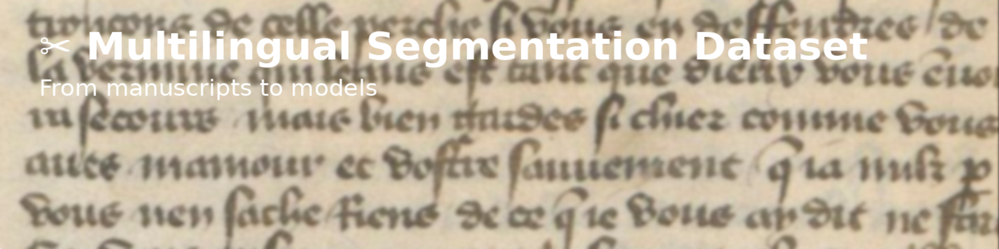
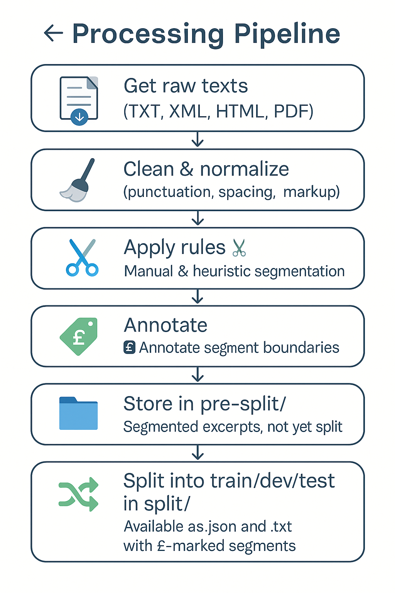

<p align="center">
  
</p>

[](https://creativecommons.org/licenses/by-nc-sa/4.0/)
[](https://github.com/ProMeText/multilingual-segmentation-dataset/releases)
[](https://github.com/ProMeText/multilingual-segmentation-dataset/commits/main)
[](https://github.com/ProMeText/multilingual-segmentation-dataset/issues)

# ✂️ Multilingual Segmentation Dataset

> **From manuscripts to models: a multilingual corpus for sentence segmentation in historical prose.**

This dataset gathers carefully segmented excerpts from a wide range of textual genres — including narrative, didactic, legal, theological, and scholarly prose — spanning seven Romance and Latin languages (13th–16th c.).  
Segment boundaries reflect both historical syntax and editorial conventions, making the corpus suitable for training and evaluating sentence segmentation models, as well as for cross-linguistic and diachronic analysis in NLP and digital philology.

## 📚 Documentation

- ✂️ **Segmentation Criteria**  
  ➡️ [`docs/annotation_guidelines/segmentation_criteria_en.md`](docs/annotation_guidelines/segmentation_criteria_en.md)

- 🧪 **Model Architecture & Training**  
  ➡️ [`docs/segmentation_model.md`](docs/segmentation_model.md)

- 🔧 **Processing Pipeline (Raw → Segmented)**  
  ➡️ [`docs/segmentation_processing_pipeline.md`](docs/segmentation_processing_pipeline.md)

- 🧾 **Annotated Examples**  
  ➡️ [`docs/segmentation_exemples.md`](docs/segmentation_exemples.md)

- 🌍 **Data Collection & Source Tracking**  
  ➡️ [`docs/data_collection_and_source_tracking.md`](docs/data_collection_notes.md)

- 🔤 **Delimiter Configuration (per language)**  
  ➡️ [`docs/annotation_guidelines/main-word-delimiters.json`](docs/annotation_guidelines/main-word-delimiters.json)

## 📖 Overview

This dataset was developed to train a multilingual sentence segmentation model, used as a pre-processing step in the automatic alignment of historical texts with [**Aquilign**](https://github.com/ProMeText/aquilign), a multilingual alignment tool developed by our team.  
Once the BERT-based models are trained and selected, they are integrated into the alignment workflow to segment texts based on learned boundary recognition — a critical step preceding alignment itself.

The segmented excerpts serve as input for Aquilign, enabling multilingual alignment across structurally and editorially diverse texts.  
A first study applying this pipeline — focused on *Lancelot en prose* — was presented in the 2024 article [*Textual Transmission without Borders*](https://2024.computational-humanities-research.org/papers/paper104/), published in the Computational Humanities Research (CHR) conference proceedings.

As the project evolved, the segmentation corpus was gradually expanded alongside the tool. Initially limited to three Romance languages — *Castilian (`es`), French (`fr`), and Italian (`it`)* — it was later enriched with **Portuguese (`pt`)**, **Catalan (`ca`)**, **Latin (`la`)**, and **English (`en`)**, thereby increasing linguistic diversity and strengthening the robustness of cross-linguistic alignment.

The corpus provides training and evaluation material for **sentence-level segmentation** in **historical prose** from the **13th to 16th centuries**.  
Texts were selected for their **genre diversity** and their ability to reflect **editorial**, **orthographic**, and **linguistic variation** across time, geography, and scribal practices.

To support **reproducibility and multilingual evaluation**, the dataset is structured by language.  
Segmented data are stored under `data/segmented/`, with language-specific files organized as follows:
- `data/segmented/pre_split/<lang>/` — complete segmented lines per language  
- `data/segmented/split/monolingual/<lang>/` — train/dev/test JSON and TXT files  
- `data/segmented/split/multilingual/` — multilingual train/dev/test splits  


## 🧾 Summary

| Category           | Details                                                                 |
|--------------------|-------------------------------------------------------------------------|
| **Languages**       | Latin (`la`), French (`fr`), English (`en`), Portuguese (`pt`), Catalan (`ca`), Italian (`it`), Castilian (`es`) |
| **Period Covered**  | 13th–16th centuries                                                    |
| **Text Formats**    | Plain text (TXT), XML, with some material converted from HTML or PDF   |
| **Segmentation**    | Manual sentence segmentation using language-specific criteria          |
| **License**         | [CC BY-NC-SA 4.0](https://creativecommons.org/licenses/by-nc-sa/4.0/) – annotations and segmentation metadata only |

## 🎯 Purpose

This dataset aims to support the training of machine learning models that can detect sentence and segment boundaries in non-standardized historical texts.

Reliable segmentation is essential for:

- downstream NLP tasks such as **parsing**, **translation**, and **alignment**,
- enhancing the **accessibility** and reusability of medieval sources,
- enabling **cross-linguistic comparison** and advancing **philological and historical-linguistic research**.

📄 For full segmentation principles, see the detailed [Segmentation Guidelines](docs/segmentation_criteria_en.md).

➡️ For model training instructions, architecture, and evaluation, see  
[**Model Documentation**](docs/segmentation_model.md).


## 🔄 Processing Pipeline

The segmentation pipeline involves the following steps, from raw historical texts to segmented training data.

<p align="center">
  
</p>

See [segmentation pipeline documentation](docs/segmentation_processing_pipeline.md) for full details on each step.


## 🌐 Data Collection Variability Across Languages
📦 For notes on text acquisition, sourcing variation, and metadata standardization, see  
➡️ [docs/data_collection_notes.md](docs/data_collection_notes.md)


## 📊 Corpus Size

Below we present the data corresponding to the most recent version of the corpus size.  
Older versions can be consulted in the [release tags](https://github.com/ProMeText/multilingual-segmentation-dataset/releases).
The current version of the corpus includes segmented excerpts in **seven historical languages**, prepared for sentence segmentation tasks.  

Each excerpt is annotated using the pound sign (`£`) to mark **segment boundaries**, typically corresponding to sentences or syntactic units.  
The corpus does **not include part-of-speech tagging or syntactic annotation** — only sentence-level segmentation.


| Language         | Texts | Segmented Tokens | Segments (`£`) | Train/Dev/Test? |
|------------------|-------|------------------|----------------|-----------------|
| **Latin** (`la`)       | 557   | 85,888              | 8,366          | ✅              |
| **French** (`fr`)      | 1,526 | 160,472             | 11,774         | ✅              |
| **English** (`en`)     | 152   | 27,072              | 2,315          | ✅              |
| **Portuguese** (`pt`)  | 987   | 101,565             | 10,477         | ✅              |
| **Catalan** (`ca`)     | 388   | 38,441              | 2,879          | ✅              |
| **Italian** (`it`)     | 2,649 | 85,290              | 6,347          | ✅              |
| **Castilian** (`es`)   | 1,436 | 111,811             | 8,091          | ✅              |
| **Total**              | 7,695 | 610,539             | 50,249         | ✅              |

**Legend:**

- **Texts** = total number of annotated examples (i.e. segmented lines)  
- **Segmented Tokens** = total number of tokens (excluding `£`)  
- **Segments (`£`)** = total number of `£` delimiters → i.e. segments  
- **Train/Dev/Test?** = indicates whether `train.json`, `dev.json`, and `test.json` are all present

> ℹ️ This corpus focuses on **sentence segmentation only**. It does **not include POS tagging, syntactic trees, or named entity annotations**.

## 📂 Data Location

The most up-to-date segmented data are stored in the repository under:

```bash
data/segmented/
```
- This folder contains the **current working version** of the segmented texts.  
- For **frozen snapshots** corresponding to published versions (e.g. baseline, augmented), please refer to the [release tags](https://github.com/ProMeText/multilingual-segmentation-dataset/releases).

## 🙏 Credits
We gratefully acknowledge the following scholars for their contributions of source material or expertise:

- **Peter Stokes & Mark Faulkner** – Guidance on available Middle English corpora  
- **Sadurní Martí** – Support in identifying Medieval Catalan corpora  
- **Andrea Menozzi** – Insights into available Medieval Italian corpora


## 🚧 Project Status

This corpus is part of an **ongoing project**. While it is already being used for segmentation and alignment tasks, **further improvements, refinements, and corrections are expected**.  
We welcome feedback, error reports, and contributions to help improve the resource over time.

Please note:
- Some segmentations may be revised in future updates.
- Metadata and annotations are subject to enhancement.
- Additional languages and texts will be added as the project evolves.

## 🔗 Related Projects
This repository is part of a broader ecosystem of tools and corpora developed for the study of medieval multilingual textual traditions:

- [Aquilign](https://github.com/ProMeText/Aquilign)  
  A clause-level multilingual alignment engine based on contextual embeddings (LaBSE), designed specifically for premodern texts.
  
- [Parallelium – an aligned scriptures dataset](https://github.com/carolisteia/parallelium-scriptures-alignment-dataset/tree/main)  
  A multilingual dataset of aligned Biblical and Qur’anic texts — spanning medieval and modern languages — designed for training and evaluating multilingual alignment models, especially in historical and philological contexts.

- [Lancelot par maints langages](https://github.com/carolisteia/lancelot-par-maints-langages)  
  A parallel corpus of translations of the *Lancelot en prose* in medieval French, Castilian, and Italian, segmented and aligned using the Aquilign pipeline.

- [Multilingual Aegidius](https://github.com/ProMeText/Multilingual_Aegidius)  
  A parallel corpus of translations of Aegidius Romanus’ *De regimine principum* in Latin, medieval Romance languages, and English, processed using the same segmentation and alignment workflow.


## 🔮 Future Directions
- Extend language coverage  
- Evaluate segmentation models  
- Broaden genre and period diversity  
- Encourage interdisciplinary use

---

## 📫 Contact & Contributions
- [Open an issue or pull request](https://github.com/ProMeText/Multilingual_Aegidius/issues)

- For academic collaboration, please reach out via GitHub Discussions

  
---
## 📚 How to Cite This dataset

> **Citation (draft)**  
> Please cite as:  
> Macedo, C., Ing, L., & Gille Levenson, M. (2025). *Multilingual Segmentation Dataset for Historical Prose (13th–16th c.)*. GitHub repository, ongoing.  
> 📌 Formal publication and DOI pending.  
  

## 💰 Funding

This work benefited from national funding managed by the **Agence Nationale de la Recherche** under the *Investissements d'avenir* programme with the reference **ANR-21-ESRE-0005 (Biblissima+)**.

> Ce travail a bénéficié d'une aide de l’État gérée par l’**Agence Nationale de la Recherche** au titre du programme d’**Investissements d’avenir** portant la référence **ANR-21-ESRE-0005 (Biblissima+)**.


<p align="center">
  
</p>

## 📄 Licensing

All annotations, segmentations, and metadata are released under [**CC BY-NC-SA 4.0**](https://creativecommons.org/licenses/by-nc-sa/4.0/).  
> ⚠️ Original textual content may be subject to source-specific licenses. Refer to the `sources` and `corpus` columns in the metadata CSV.   

[Jump to compiled data CSV ⤵️](https://github.com/carolisteia/mulada/blob/main/data.csv)


