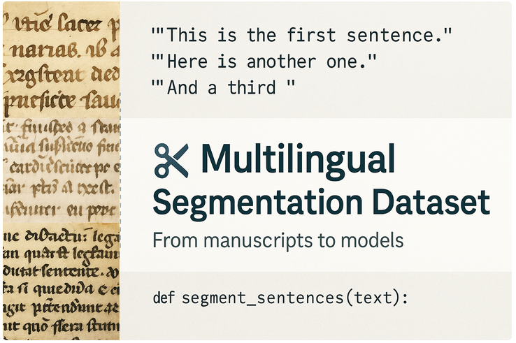

  

# ✂️ Multilingual Segmentation Dataset

> **From manuscripts to models: a multilingual corpus for sentence segmentation in historical prose.**

This dataset gathers carefully segmented excerpts from a wide range of textual genres — including narrative, didactic, legal, theological, and scholarly prose — spanning seven Romance and Latin languages (13th–16th c.).  
Segment boundaries reflect both historical syntax and editorial conventions, making the corpus suitable for training and evaluating sentence segmentation models, as well as for cross-linguistic and diachronic analysis in NLP and digital philology.

## 📖 Overview

This dataset was developed to train a multilingual sentence segmentation model used as a pre-processing step in the automatic alignment of historical texts with [**Aquilign**](https://github.com/ProMeText/aquilign), a multilingual alignment tool developed by our team.  
Once the BERT-based models are trained and selected, they are integrated into the alignment workflow to segment texts based on learned boundary recognition — a critical step preceding the alignment itself.

The segmented excerpts serve as input for Aquilign, enabling multilingual alignment across structurally and editorially diverse texts. A first study applying this pipeline — focused on *Lancelot en prose* — was presented in the 2024 article [*Textual Transmission without Borders*](https://2024.computational-humanities-research.org/papers/paper104/), published as part of the Computational Humanities Research (CHR) conference proceedings.

As the project evolved, the segmentation corpus was gradually expanded alongside the tool. Initially limited to three Romance languages — *Castilian (`es`), French (`fr`), and Italian (`it`)* — it was later enriched with **Portuguese (`pt`)**, **Catalan (`ca`)**, **Latin (`la`)**, and **English (`en`)**, increasing linguistic diversity and enhancing the robustness of cross-linguistic alignment.

To support reproducibility and multilingual evaluation, the dataset is organized by work: each text is stored in a dedicated folder containing the source (`raw/`) and segmented (`segmented/`) versions.

The corpus provides training and evaluation material for **sentence-level segmentation** in **historical prose** from the **13th to 16th centuries**. Texts were selected for their **genre diversity**, as well as their capacity to reflect **editorial**, **orthographic**, and **linguistic variation** across time, geography, and scribal practices.

## 🧾 Summary

| Category           | Details                                                                 |
|--------------------|-------------------------------------------------------------------------|
| **Languages**       | Latin (`la`), French (`fr`), English (`en`), Portuguese (`pt`), Catalan (`ca`), Italian (`it`), Castilian (`es`) |
| **Period Covered**  | 13th–16th centuries                                                    |
| **Text Formats**    | Plain text (TXT), XML, with some material converted from HTML or PDF   |
| **Segmentation**    | Manual sentence segmentation using language-specific criteria          |
| **License**         | [CC BY-NC-SA 4.0](https://creativecommons.org/licenses/by-nc-sa/4.0/) – annotations and segmentation metadata only |

## 🎯 Purpose

The primary goal of this dataset is to support the training of machine learning models capable of identifying **sentence and segment boundaries** in **non-standardized historical texts**.  
Reliable segmentation is essential for:

- downstream NLP tasks such as **parsing**, **translation**, and **alignment**,
- enhancing the **accessibility** and reusability of medieval sources,
- enabling **cross-linguistic comparison** and advancing **philological and historical-linguistic research**.

## 🔄 Processing Pipeline

The segmentation pipeline involves the following steps, from raw historical texts to segmented training data.

  

See [segmentation pipeline documentation](docs/segmentation_processing_pipeline.md) for full details on each step.

## 🌐 Data Collection Variability Across Languages

The process of text acquisition varied considerably depending on the language.

- For some languages, such as **French**, acquisition was straightforward thanks to well-structured resources like the [**BFM Corpus**](https://gitlab.huma-num.fr/bfm/bfm-textes-diffusion/-/tree/main/TXT?ref_type=heads).

- For **Portuguese**, **English**, and **Italian**, we used structured corpora such as the [**CTA**](https://teitok.clul.ul.pt/teitok/cta/index.php?action=home), [**LAEME**](http://amc.ppls.ed.ac.uk/laeme/texts.html), and [**Biblioteca Italiana**](http://www.bibliotecaitaliana.it/percorsi/19). These provided valuable data, though required **more intensive preparation**.

- In contrast, resources like the **OVI** (Italian) and **CICA** (Catalan) offered limited public access, prompting recovery from **critical editions** or **web scraping** when necessary.

This variability demanded a **flexible, language-sensitive approach** to both **sourcing** and **preprocessing**.

## 🧾 Source Tracking & Metadata

To ensure **transparency**, **consistency**, and **reproducibility**, an internal application form was created to standardize metadata collection for each text in the segmentation corpus.  
This form captured key details such as:

- 📌 **Source type** (digital edition, manuscript, OCR, etc.)  
- 📚 **Edition or manuscript reference** (bibliographic citation)  
- 🌍 **Linguistic variety** and **chronological range**  
- 🗂️ **Format and structure** of the original file  
- 📝 **Reuse/licensing conditions**

Although the form itself is not public, we provide access to the processed metadata and scripts used during compilation:

**🔗 Resources:**

- 📂 [Data Processing Repository (`mulada`)](https://github.com/carolisteia/mulada):  
  Streamlit app and scripts used to structure, validate, and convert incoming texts and metadata  
- 📊 [Compiled Metadata CSV (`data.csv`)](https://github.com/carolisteia/mulada/blob/main/data.csv):  
  Central table listing all texts with language, edition, source, format, license, and file references

## 📊 Corpus Size

The current version of the corpus includes segmented excerpts in **seven historical languages**, prepared for sentence segmentation tasks.

Each excerpt is annotated using the pound sign (`£`) to mark **segment boundaries**, typically corresponding to sentences or syntactic units. The corpus does **not include part-of-speech tagging or syntactic annotation**—only sentence-level segmentation.

| Language         | Texts | Segmented Tokens | Segments (`£`) | Train/Dev/Test? |
|------------------|-------|------------------|----------------|-----------------|
| **Latin** (`la`)       | 557   | 85,888              | 8,366          | ✅              |
| **French** (`fr`)      | 1,526 | 160,472             | 11,774         | ✅              |
| **English** (`en`)     | 152   | 27,072              | 2,315          | ✅              |
| **Portuguese** (`pt`)  | 987   | 101,565             | 10,477         | ✅              |
| **Catalan** (`ca`)     | 388   | 38,441              | 2,879          | ✅              |
| **Italian** (`it`)     | 2,649 | 85,290              | 6,347          | ✅              |
| **Castilian** (`es`)   | 1,436 | 111,811             | 8,091          | ✅              |
| **Total**              | 7,695 | 610,539             | 50,249         | ✅              |

**Legend:**

- **Texts** = total number of annotated examples (i.e. segmented lines)  
- **Segmented Tokens** = total number of tokens (excluding `£`)  
- **Segments (`£`)** = total number of `£` delimiters → i.e. segments  
- **Train/Dev/Test?** = indicates whether `train.json`, `dev.json`, and `test.json` are all present

> ℹ️ This corpus focuses on **sentence segmentation only**. It does **not include POS tagging, syntactic trees, or named entity annotations**.

## 🚧 Project Status

This corpus is part of an **ongoing project**. While it is already being used for segmentation and alignment tasks, **further improvements, refinements, and corrections are expected**.  
We welcome feedback, error reports, and contributions to help improve the resource over time.

Please note:
- Some segmentations may be revised in future updates.
- Metadata and annotations are subject to enhancement.
- Additional languages and texts will be added as the project evolves.

## 🔮 Future Directions

- Extend language coverage  
- Evaluate segmentation models  
- Broaden genre and period diversity  
- Encourage interdisciplinary use

---

## 📄 Licensing

All annotations, segmentations, and metadata are released under [**CC BY-NC-SA 4.0**](https://creativecommons.org/licenses/by-nc-sa/4.0/).  
> ⚠️ Original textual content may be subject to source-specific licenses. Refer to the `sources` and `corpus` columns in the metadata CSV.   

[Jump to compiled data CSV ⤵️](https://github.com/carolisteia/mulada/blob/main/data.csv)

---
## 📚 How to Cite This Corpus

> **Citation (draft)**  
> Please cite as:  
> Macedo, C., Ing, L., & Gille Levenson, M. (2025). *Multilingual Segmentation Corpus for Historical Prose (13th–16th c.)*. GitHub repository, ongoing.  
> 📌 Formal publication and DOI pending.  

## 📫 Contact & Contributions
- [Open an issue or pull request](https://github.com/ProMeText/Multilingual_Aegidius/issues)

- For academic collaboration, please reach out via GitHub Discussions
