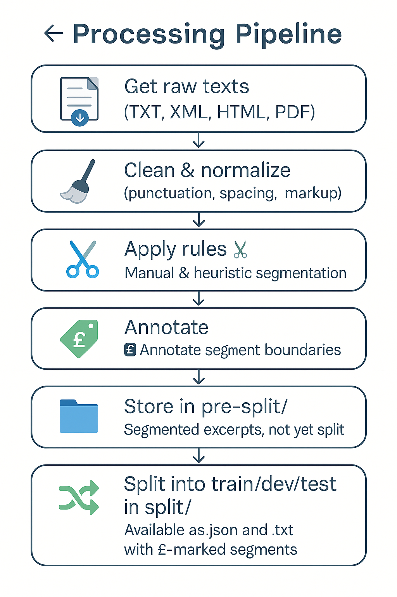

# Segmentation Processing Pipeline

This document describes the data preparation pipeline used to build the multilingual segmentation dataset.  
It details the steps taken from raw text collection to the production of segmented, model-ready files.

---

##  1. Collect Raw Texts

Texts were collected from a wide range of sources, including digital editions, OCR outputs, and manually transcribed files.  
Preferred formats included:

- `.txt` (plain text)
- `.xml` (TEI, custom formats)
- `.html` / `.pdf` (converted to plain text using external tools)

---

##  2. Clean and Normalize

All files underwent **basic cleaning**, mostly using **regular expressions**, to normalize:

- markup and tags (removal or replacement)
- inconsistent whitespace and line breaks
- encoding anomalies (e.g., non-UTF-8)

>  **Note:** This step does **not** involve orthographic normalization.  
Original spelling, punctuation, and diacritics were preserved to maintain historical variation.

---

##  3. Segment Texts

Segmentation was performed using a **hybrid approach** combining:

- **manual annotation** by trained annotators  
- **rule-based heuristics** to accelerate the process (e.g., splitting at discourse markers; see [`word_delimiters.md`](word_delimiters.md))

---

## 4. Annotate Boundaries

Segment boundaries are marked using the `£` symbol.  
The `£` delimiter is consistent across formats (`.txt`, `.json`) and enables straightforward tokenization for machine learning tasks.  
It also supports binary labeling of tokens: `1` for a segmentation point (i.e., when a token is followed by `£`), and `0` otherwise.

---

##  5. Organize in `pre_split/`

Files with annotated segments (using `£`) are stored in the `pre_split/` folder.  
They are **not yet split** into `train/dev/test`.  
Formats:

- `.txt` (plain text with `£`)
- `.json` (structured format for ML input)

---

## 6. Split into Train/Dev/Test

Files are then partitioned into the `split/` folder, with the following structure:

- `train/`, `dev/`, and `test/` subfolders per language
- Each subfolder contains:
  - `.txt` files with `£` delimiters
  - `.json` files with segmented data in ML-friendly format

---

##  Visual Summary

---

##  Output Folder Summary

- `raw/`: Cleaned, unsegmented text
- `segmented/pre_split/`: Fully segmented excerpts, not partitioned
- `segmented/split/`: Segmented and partitioned into ML subsets

---

##  Related Files

- [`word_delimiters.json`](word_delimiters.json) – Language-specific word boundary rules  
- [`segmentation_criteria.md`](segmentation_criteria.md) – Sentence segmentation principles and heuristics  
- [`segmentation_exemples.md`](segmentation_exemples.md) – Annotated examples in multiple languages

🔙 Back to [README](../README.md)
